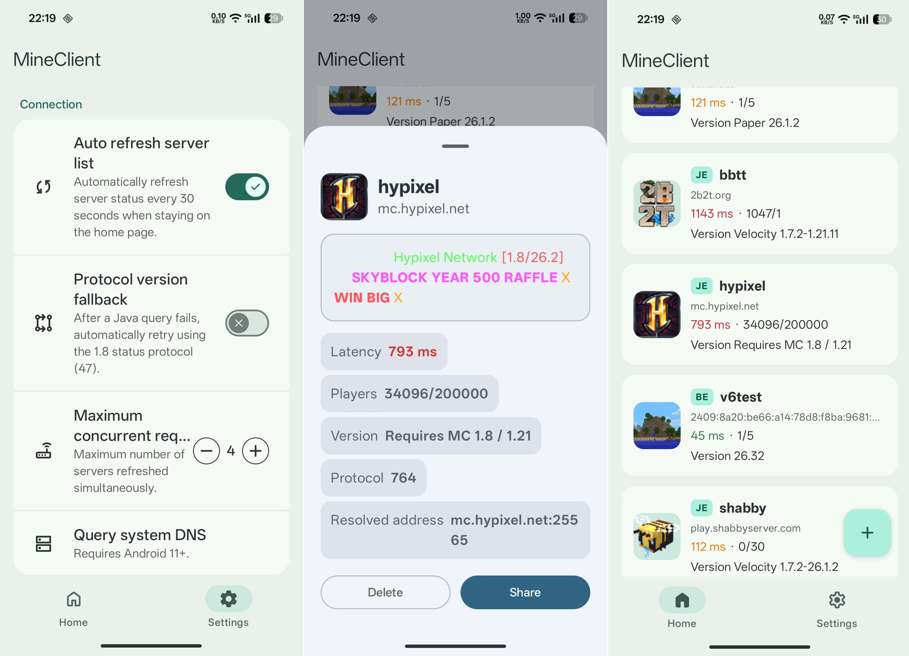

# MineClient

  

  A modern Minecraft server query tool.

  Supports MCJE & MCBE • IPv4 & IPv6 • MD3E UI

---

---

## ✨ Features

- 🎮 **Minecraft Server Query**
  - Supports **Minecraft Java Edition**
  - Supports **Minecraft Bedrock Edition**
  - Supports **IPv4 and IPv6**

- 📡 **Server Information**
  - Server status detection
  - Player count display
  - Version information
  - MOTD rendering

- 🎨 **Modern UI**
  - Designed with **Material 3 Expressive**
  - Clean and adaptive user interface
  - Smooth Compose animations

- 🏗️ **Modern Architecture**
  - **Compose Multiplatform Ready** architecture
  - Built with Jetpack Navigation3

---

## 📱 Screenshots

---

## 🌍 Open Source

MineClient is fully open source and welcomes contributions.

Licensed under the GNU General Public License v3.0.

